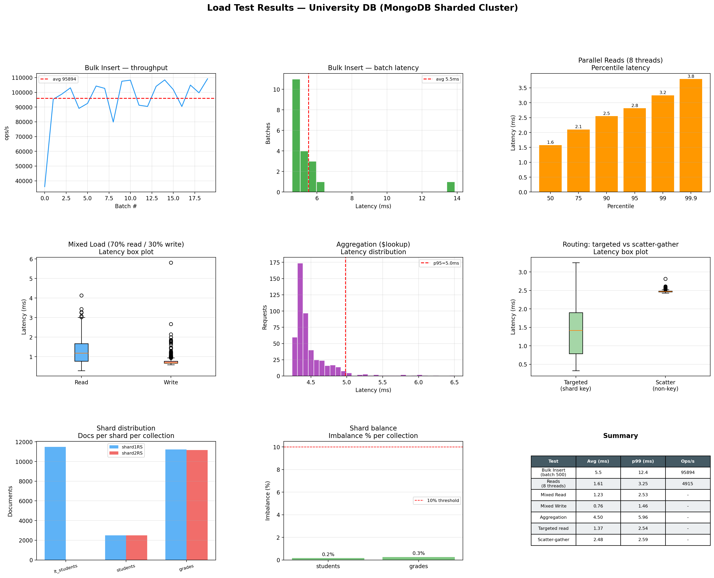

# Отчёт. Модуль 3 — Нереляционные базы данных

## 1. Схема базы данных

База данных `university` содержит четыре коллекции.

**departments** — факультеты:

```json
{
  "department_id": "uuid",
  "name": "Факультет информатики",
  "code": "FIVT",
  "created_at": "ISODate"
}
```

**students** — студенты:

```json
{
  "student_id": "uuid",
  "first_name": "Иван",
  "last_name": "Иванов",
  "faculty_id": "uuid",
  "group_name": "CS-101",
  "enrollment_year": 2022,
  "created_at": "ISODate"
}
```

**courses** — дисциплины:

```json
{
  "course_id": "uuid",
  "title": "Базы данных",
  "code": "DB101",
  "credits": 4,
  "created_at": "ISODate"
}
```

**grades** — оценки:

```json
{
  "grade_id": "uuid",
  "student_id": "uuid",
  "course_id": "uuid",
  "grade": 5,
  "semester": "2024-S1",
  "graded_at": "ISODate"
}
```

---

## 2. Реализация шардинга

### Топология кластера

```
Client
  |
mongos :27020  (query router)
  |
Config Server — configRS :27019
  |
  +--- Shard 1 — shard1RS :27018
  +--- Shard 2 — shard2RS :27017
```

Все компоненты запускаются одной командой `make up`. Порядок инициализации задан через `depends_on` и `healthcheck`:
сначала стартуют три MongoDB-процесса, затем контейнер `rs-init` инициализирует replica sets на каждом из них, после
этого поднимается mongos, и только потом контейнер `init` добавляет шарды и настраивает коллекции.

### Выбор стратегии

Для коллекций `students` и `grades` используется **hashed sharding** по полю `student_id`.

Причины выбора:

1. `student_id` — UUID v4, поэтому хэш-функция MongoDB даёт равномерное распределение документов без ручной настройки
   диапазонов.
2. При range sharding по монотонному ключу все новые документы попадали бы на один шард. Hashed sharding этого избегает.
3. Коллекция `grades` шардируется по тому же полю `student_id`, что и `students`. Все оценки конкретного студента лежат
   на одном шарде, и запрос "все оценки студента X" не требует scatter-gather по всем шардам.

### Ключевые команды инициализации

```javascript
sh.addShard("shard1RS/shard1:27018");
sh.addShard("shard2RS/shard2:27017");
sh.enableSharding("university");

db.students.createIndex({student_id: "hashed"});
sh.shardCollection("university.students", {student_id: "hashed"});

db.grades.createIndex({student_id: "hashed"});
sh.shardCollection("university.grades", {student_id: "hashed"});
```

### Распределение данных

После загрузки 5 000 студентов и ~22 500 оценок (`make seed`):

```
university.students
  shard1RS:  ~50.0%
  shard2RS:  ~50.0%
  imbalance: 0.2%

university.grades
  shard1RS:  ~50.0%
  shard2RS:  ~50.0%
  imbalance: 0.3%
```

Распределение практически идеальное, что подтверждает правильность выбора hashed sharding.

---

## 3. Python-интерфейс

Консольный интерфейс реализован в `app/client.py`. Логика работы с базой вынесена в `app/db.py`.

Доступные операции:

- Факультеты: список, добавление
- Студенты: поиск по фамилии и по факультету, добавление, обновление, удаление (с каскадным удалением оценок)
- Курсы: список, добавление
- Оценки: просмотр (с `$lookup` к курсам), выставление, изменение
- Статистика распределения документов по шардам

Запуск:

```bash
make client
```

---

## 4. Нагрузочное тестирование

### Методология

Скрипт: `tests/load_test.py`. Запуск: `make seed && make test`.

| # | Тест                       | Параметры                                          |
|---|----------------------------|----------------------------------------------------|
| 1 | Bulk Insert                | 10 000 документов, батчи по 500                    |
| 2 | Параллельные чтения        | 5 000 запросов, 8 потоков                          |
| 3 | Смешанная нагрузка         | 5 000 операций, read 70% / write 30%               |
| 4 | Агрегация                  | 500 запросов с `$lookup` по `faculty_id`           |
| 5 | Распределение по шардам    | `$collStats` по трём коллекциям, подсчёт imbalance |
| 6 | Targeted vs scatter-gather | 200 запросов каждого типа                          |

### Результаты

| Тест                            | Avg (мс) | p99 (мс) | Throughput   |
|---------------------------------|----------|----------|--------------|
| Bulk Insert (батч 500)          | 5.5      | 12.4     | 95 894 ops/s |
| Параллельные чтения (8 потоков) | 1.61     | 3.25     | 4 915 rps    |
| Mixed Read                      | 1.23     | 2.53     | —            |
| Mixed Write                     | 0.76     | 1.46     | —            |
| Aggregation ($lookup)           | 4.50     | 5.96     | —            |
| Targeted read (shard key)       | 1.37     | 2.54     | —            |
| Scatter-gather (non-key)        | 2.48     | 2.59     | —            |

### Визуализация



### Вывод в консоли

```text
==================================================
  Load Test — University DB
==================================================

[1] Bulk insert: 10000 docs
  25%  batch 5/20  5.6ms
  50%  batch 10/20  4.6ms
  75%  batch 15/20  4.6ms
  100%  batch 20/20  4.6ms
  done: 10000 docs in 0.11s  avg=5.5ms/batch  tput=90537 ops/s

[2] Parallel reads: 5000 requests, 8 threads
  done: 5000 reads in 1.02s  avg=1.61ms  p99=3.25ms  tput=4915 rps

[3] Mixed load 70/30: 5000 ops
  done: 5000 ops in 5.48s  read_avg=1.23ms  write_avg=0.76ms

[4] Aggregation ($lookup): 500 requests
  done: avg=4.50ms  p95=4.98ms  p99=5.96ms

[5] Shard distribution check
  lt_students (11483 docs):
    shard1RS: 11483 docs  (100.0%)
  students (5000 docs):
    shard1RS: 2496 docs  (49.9%)
    shard2RS: 2504 docs  (50.1%)
    imbalance: 0.2%
  grades (22392 docs):
    shard1RS: 11225 docs  (50.1%)
    shard2RS: 11167 docs  (49.9%)
    imbalance: 0.3%

[6] Routing: targeted vs scatter-gather (200 queries each)
  targeted  avg=1.37ms  p99=2.54ms
  scatter   avg=2.48ms  p99=2.59ms
  scatter overhead: x1.8

Total time: 9.7s

Chart saved: /app/tests/../report/load_test_results.png
```

### Выводы

Точечные чтения по hashed ключу выполняются с медианой ~1.37 мс — mongos напрямую роутит запрос на один шард.
Scatter-gather запросы (по не-шардовому полю) в среднем в ~1.8 раза медленнее: mongos вынужден опросить оба шарда и
смержить результаты.

Агрегации с `$lookup` (~4.5 мс) ожидаемо медленнее точечных чтений, p99 в пределах 6 мс.

Распределение по шардам: imbalance 0.2% для `students` и 0.3% для `grades` — близко к идеальному 50/50, что подтверждает
равномерность hashed sharding.

---

## 5. Репозиторий

Ссылка на репозиторий: https://github.com/Aoladiy/HSE_OCHIROV_ALDAR/tree/master/NoSQL/final-task-module-3/report
